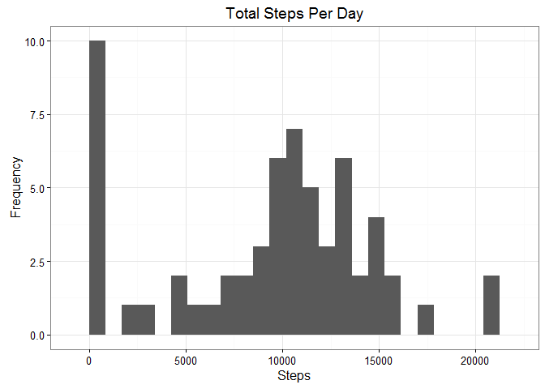
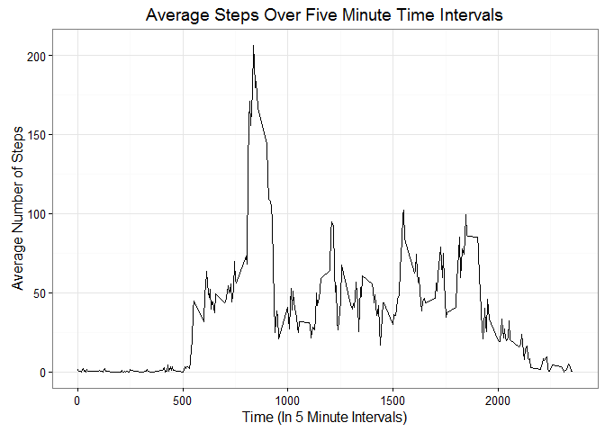
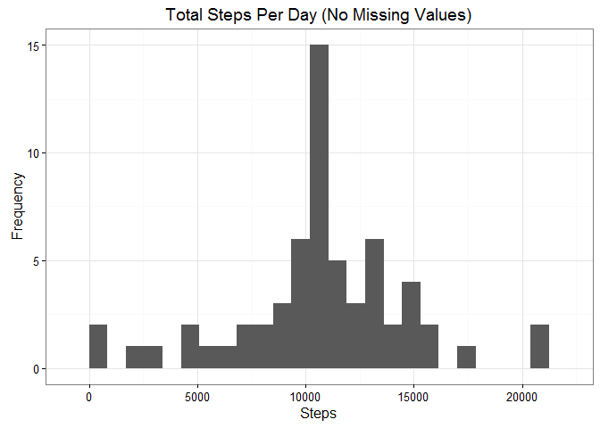
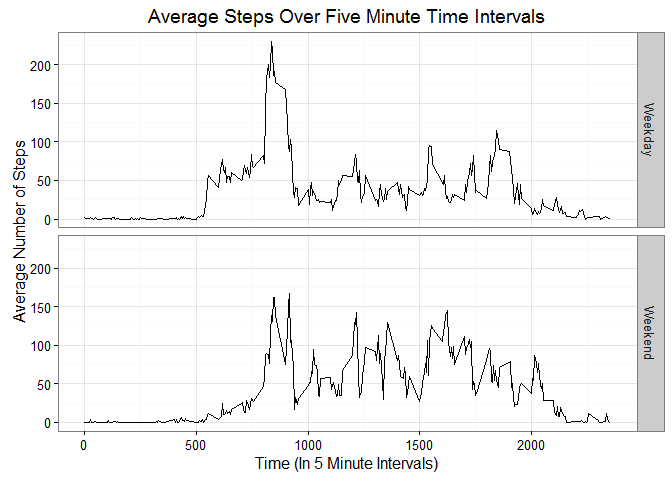

# Reproducible Research: Peer Assessment 1
Stephanie Lum  
March 15, 2016  


## Loading and preprocessing the data

This code extract **activity.csv** from **activity.zip** if it has not already done so, and process it the data into a suitable format for analysis.


```r
# Check to see if the file has been extracted. If not, extract file.
if (!file.exists("activity.csv")) {
      unzip("activity.zip")
}

# Load the data
activity <- read.csv("activity.csv")

# Convert date from Factor to Date class
activity$date <- as.Date(activity$date)

# Load libraries and transform data to make it suitable for analysis
library(dplyr)
activity <- tbl_df(activity)
```

## What is mean total number of steps taken per day?

A histogram of the total number of steps taken per day is generated.  


```r
# Load necessary libraries for plotting
library(ggplot2)

# Create a summary of the number of steps by date
stepsbydate <- summarize(group_by(activity, date), steps = sum(steps, na.rm = TRUE))

# Create a histogram of the total number of steps taken per day
ggplot(stepsbydate, aes(x = steps)) +
      geom_histogram(binwidth = 850) +
      ggtitle("Total Steps Per Day") +
      xlab("Steps") +
      ylab("Frequency") +
      theme_bw()
```



```r
# Calculate the mean steps per day
mean(stepsbydate$steps)
```

```
## [1] 9354.23
```

```r
# Calculate the median steps per day
median(stepsbydate$steps)
```

```
## [1] 10395
```

The mean steps per day is approximately **9354** steps. The median steps per days is **10395** steps.

## What is the average daily activity pattern?

A time series plot of the 5 minute intervals and the average number of steps taken, averaged across all days, is generated.


```r
# Create a summary of the average number of steps by time interval
stepsbyinterval <- summarize(group_by(activity, interval), steps = mean(steps, na.rm = TRUE))

# Create a time series plot of average number of steps by time interval
ggplot(stepsbyinterval, aes(x = interval, y = steps)) +
      geom_line() +
      xlab("Time (In 5 Minute Intervals)") +
      ylab("Average Number of Steps") +
      ggtitle("Average Steps Over Five Minute Time Intervals") +
      theme_bw()
```



```r
# Find the time interval with the most steps on average
maxsteps <- max(stepsbyinterval$steps)
with(stepsbyinterval, interval[steps == maxsteps])
```

```
## [1] 835
```

On average across all the days in the dataset, the time interval that contains the maximum number of steps is the interval from **8:35AM to 8:40AM**.

## Inputting missing values


```r
# Calculate the number of rows with NA values
sum(!complete.cases(activity))
```

```
## [1] 2304
```

There are **2304 rows** with a missing value, or `NA`, in the dataset.

In order to conduct a more accurate analysis, these missing values will be replaced by the average number of steps across all day for that time interval.


```r
# Create a copy of the dataset. Keep copies of the previous tables.
activity_old <- activity
stepsbydate_old <- stepsbydate
stepsbyinterval_old <- stepsbyinterval

# Merge the new dataset with the summary of average steps per time interval
activity_merge <- merge(activity, stepsbyinterval, by = "interval", suffixes = c(".original", ".average"))
activity_merge <- arrange(activity_merge, date)

# Find the row numbers where there are NA values
indexNA <- which(is.na(activity$steps))

# Replace the NA values with the average step value for that time interval
activity[indexNA, "steps"] = activity_merge[indexNA, "steps.average"]
```

A histogram of the total number of steps per day (with filled in missing values) is generated.


```r
# Create a summary of the number of steps by date
stepsbydate <- summarize(group_by(activity, date), steps = sum(steps, na.rm = TRUE))

# Create a histogram of the total number of steps taken per day
ggplot(stepsbydate, aes(x = steps)) +
      geom_histogram(binwidth = 850) +
      ggtitle("Total Steps Per Day (No Missing Values)") +
      xlab("Steps") +
      ylab("Frequency") +
      theme_bw()
```



```r
# Calculate the mean steps per day
mean(stepsbydate$steps)
```

```
## [1] 10766.19
```

```r
# Calculate the median steps per day
median(stepsbydate$steps)
```

```
## [1] 10766.19
```

With all the missing values filled in, both the mean and the median number of steps per day are about **10766** steps.  

This is a big change from the mean and median before the values were filled in, 9354 and 10395 steps, respectively. This change is probably because of the increased amount of data there is now to work with after filling in the missing values. Additional analysis may be conducted with replacing some of the "0" values with the average step count in order to obtain a more accurate picture of the overall step performance throughout the day.

## Are there differences in activity patterns between weekdays and weekends?

A new factor variable `day` is created to indicate whether or not a given date is a weekday or a weekend day.


```r
# Create a new variable that states what day of the week it is
activity$daysoftheweek <- weekdays(activity$date)

# Define weekend and weekday day and separate day of the week into factors
activity$day <- as.factor(c("Weekend", "Weekday"))

weekend <- activity$daysoftheweek == "Saturday" | activity$daysoftheweek == "Sunday"

activity$day[weekend] <- "Weekend"
activity$day[!weekend] <- "Weekday"
```

A time series plot comparing the average number of steps taken across all weekday or weekend days in 5 minute time intervals is generated.


```r
# Create a summaries of the average number of steps by time interval by weekday and weekend
stepsbyinterval <- summarize(group_by(activity, interval, day), steps = mean(steps, na.rm = TRUE))

# Create a time series plot of average number of steps by time interval
ggplot(stepsbyinterval, aes(x = interval, y = steps)) +
      geom_line() +
      xlab("Time (In 5 Minute Intervals)") +
      ylab("Average Number of Steps") +
      ggtitle("Average Steps Over Five Minute Time Intervals") +
      facet_grid(day~.) +
      theme_bw()
```



There is a slight decrease in activity earlier in the day on the weekends, possibly because people are sleeping in later than during the weekdays. Otherwise, the data for the average steps over 5 minute time intervals reamin relatively consistent between weekday and weekend days.
